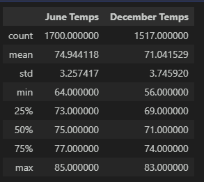

# Surfs_Up
Analyzing weather on the Hawaiian island where we want to open up a surf shop on. I will be using jupyter notebook, vscode, python, and SQLite.

## Overview
The purpose of this analysis is to compare the weather conditions in the months of June and December in Oahu, with the aim of understanding the key differences in temperature trends between these two months. The analysis is based on historical temperature data for June and December, including mean temperature, standard deviation, minimum temperature, maximum temperature, and percentiles. The results of this analysis will provide insights into the variations in weather patterns between these two months, which can be useful for determining the sustainability of a surf and ice cream shop business in Oahu throughout the year.

## Results

* June: Higher mean temperature (74.944118) compared to December (71.041529).
* December: Larger standard deviation (3.745920) compared to June (3.257417).
* June: Higher maximum temperature (85) compared to December (83).
* December: Lower minimum temperature (56) compared to June (64).
* June: Higher quartiles (25th, 50th, and 75th percentiles) compared to December.

## Summary
June tends to have higher average temperatures and less temperature variability compared to December in Oahu. Further analysis on precipitation and wind patterns is recommended to better understand weather trends and assess the sustainability of the surf and ice cream shop business throughout the year.

